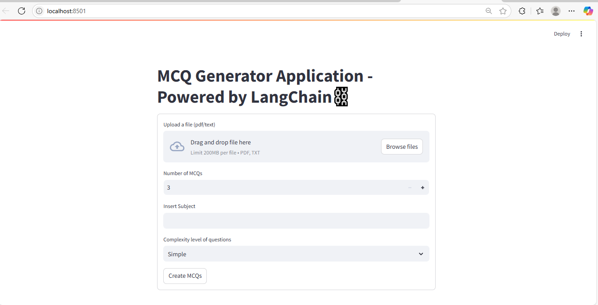

---

# 🧠 MCQ Generator Application  
**Powered by LangChain & Streamlit**

Generate multiple-choice quizzes from text or PDF files using the latest LLMs.

---

## 📦 Features

- Upload text or PDF files to create MCQs instantly.
- Powered by LangChain for smart quiz generation.
- Clean and easy-to-use Streamlit interface.
- Optionally uses OpenAI API for enhanced results.

---

## 🚀 Quick Start

### **Deploy on AWS EC2 (Ubuntu)**

#### Launch EC2

- Log in to your [AWS Console](https://aws.amazon.com/console/)
- Launch an **EC2 instance** using **Ubuntu**
- Configure settings, key pair, and start your instance

#### Set Up Ubuntu Instance

```bash
sudo apt update
sudo apt-get update
sudo apt upgrade -y
sudo apt install git curl unzip tar make sudo vim wget -y
```

#### Clone the Repository

```bash
git clone https://github.com/soodkunal/mcqgen.git
cd mcqgen
```

#### Install Python & Requirements

```bash
sudo apt install python3-pip -y
pip3 install -r requirements.txt
```

#### Add OpenAI API Key (Optional)

```bash
touch .env
vi .env
# In .env file, add your key:
OPENAI_API_KEY=your_openai_key_here
```
*Press `i` to insert, paste your key, then `Esc` → `:wq` → `Enter` to save.*

#### Run the App

```bash
python3 -m streamlit run streamlit_app.py
```

---

## 🌐 Access in Browser

1. Update EC2 Security Group inbound rules:
   - Add Custom TCP Rule  
     - **Port:** 8501  
     - **Source:** Anywhere (0.0.0.0/0)

2. Visit:  
   ```
   http://<your-ec2-public-ip>:8501
   ```

---

## 🖼️ Example Screenshot  


---

## 📄 License

This project is licensed under the MIT License.

---

**Tips for further improvement:**  
- Add badges (build status, license, etc.) at the top.  
- Include a screenshot or GIF of your app.  
- Provide sample input and output for users.  
- Link to documentation or demo if possible.

---
